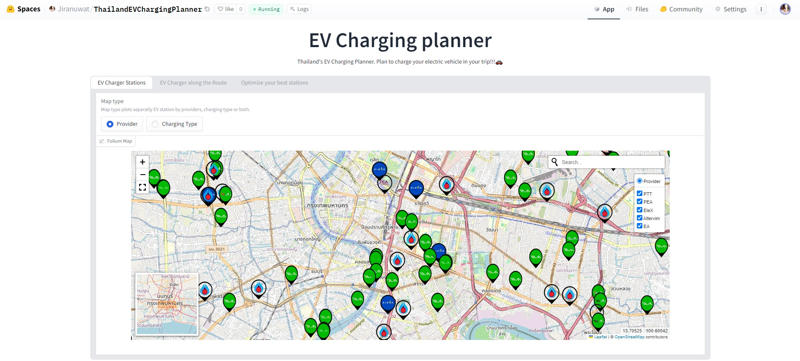
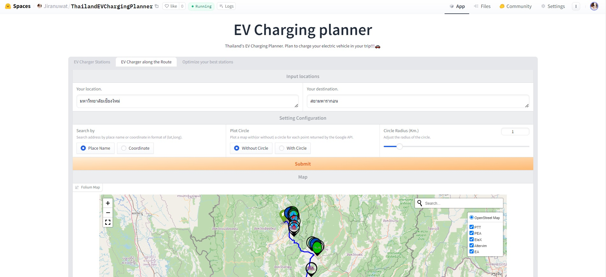
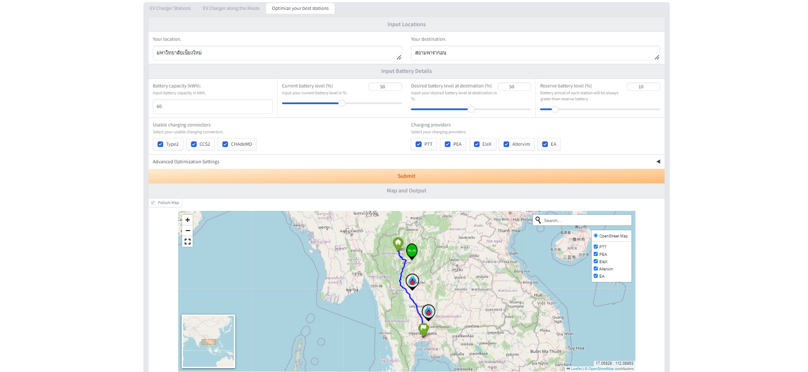

# EV Charging Planner README

- This project utilized optimization algorithms to optimize the selection of EV charging stations along user-defined routes, leveraging routing through the Google Maps API and sourcing EV station data from Google Maps XML files.

## Table of Contents

- [EV Charging Planner README](#ev-charging-planner-readme)
  - [Table of Contents](#table-of-contents)
  - [License](#license)
  - [Colaborators](#colaborators)
  - [Huggingface🤗](#huggingface)
  - [Features](#features)
  - [Acknowledgements](#acknowledgements)

## License

This project was submitted as a requirement for the Department of Data Science, Faculty of Science, at Chiang Mai University.

## Colaborators

- [PanuvitPNV](https://github.com/PanuvitPNV)
- [DJN226](https://github.com/DJN226)

## Huggingface🤗

https://huggingface.co/spaces/Jiranuwat/ThailandEVChargingPlanner

## Features
This project comprises three main pages:
- **EV Charger Stations:** Displays all EV stations across Thailand.

- **EV Charger along the Route:** Identifies all EV charging stations along a specified route.

- **Optimize your best stations:** Helps users select the most suitable station based on their requirements.

## Acknowledgements

This project would not have been possible without the support and resources provided by various libraries and infrastructure services. I would like to extend my heartfelt gratitude to the following:

- [**Gradio**](https://www.gradio.app/): For providing a user-friendly interface that made developing and deploying the application seamless and efficient.
- [**Hugging Face**](https://huggingface.co/): For hosting the Gradio application and providing an excellent platform for deploying and sharing AI applications.
- [**Google Cloud Run**](https://cloud.google.com/run): For offering a reliable and scalable solution to host the optimizer API, ensuring smooth and efficient operation.
- [**DigitalOcean**](https://www.digitalocean.com/): For providing robust hosting solutions that complemented the deployment of the optimizer API.
- [**Flask**](https://flask.palletsprojects.com/): For its simplicity and flexibility in building the API that powers the backend of this project.
- [**MongoDB**](https://www.mongodb.com/): For offering a flexible and scalable database solution that efficiently handled the data management needs of this project.

Thank you to all the developers and contributors of these amazing tools and platforms. Your work has been invaluable to the success of this project.
